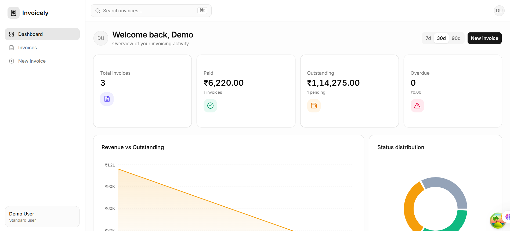
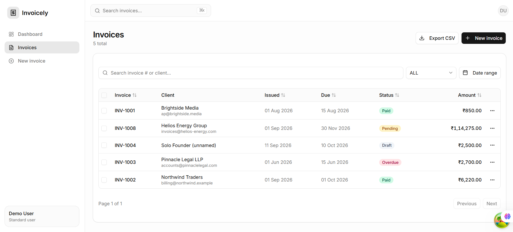
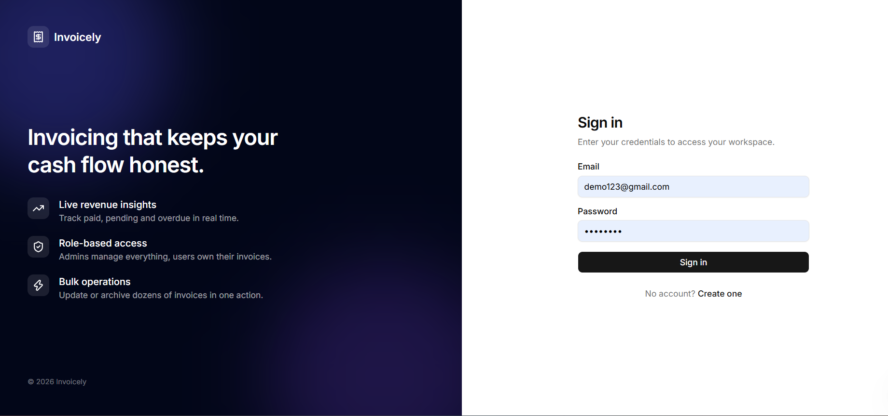

# Invoice Management System

[](https://nodejs.org/)
[](https://react.dev/)
[](https://www.typescriptlang.org/)
[](https://www.prisma.io/)
[](https://neon.tech/)
[](https://opensource.org/license/isc-license-txt)

An end-to-end invoice workspace for creating, tracking, searching, and exporting invoices with secure, role-aware access controls.

## Project Overview

Invoice Management System is a production-oriented web application that centralizes the invoice lifecycle—from creation and line-item management through payment tracking, reporting, and export. It gives teams a fast, consistent way to understand outstanding receivables and act on overdue invoices.

The application pairs a TypeScript/Express API with Prisma and PostgreSQL (Neon), and a React/Vite client designed for responsive operational workflows. JWT authentication, validation at the API boundary, role-aware authorization, and standard HTTP hardening are built into the platform rather than added as an afterthought.

Administrators can work across the invoice set and use privileged actions such as deletion, while standard users work within the invoices they own. The interface adapts to the signed-in role to keep available actions clear and appropriate.

## Quick Start

```bash
git clone <repository-url>
cd "Invoice Management System"

# Terminal 1 — API
cd backend
npm install
# Create .env from the configuration shown below, then:
npx prisma generate
npx prisma migrate dev
npm run dev

# Terminal 2 — web client
cd frontend
npm install
# Create .env with VITE_API_BASE_URL=http://localhost:3000/api
npm run dev
```

Open the Vite URL printed in the second terminal (normally `http://localhost:5173`).

## Features

- [x] **Actionable dashboard** — at-a-glance totals for invoices, paid invoices, pending amount, and overdue invoices.
- [x] **Invoice list workspace** — table-based browsing with server-side pagination, sorting, full-text search, status filtering, and date-range filtering.
- [x] **Invoice details** — an invoice summary, customer data, calculated totals, line items, notes, and a download action in one view.
- [x] **Invoice lifecycle management** — create, update, view, and delete invoices, with supported statuses: `DRAFT`, `PENDING`, `PAID`, `OVERDUE`, and `CANCELLED`.
- [x] **Bulk operations** — select multiple invoices to update status or apply permitted delete actions efficiently.
- [x] **CSV export** — export the current filtered invoice data for reconciliation or downstream reporting.
- [x] **Secure authentication** — registration and login flows backed by JWT access tokens.
- [x] **Role-aware experience** — `ADMIN` and `USER` roles enforce ownership and reveal only the actions the current user can perform.
- [x] **Protected routes** — unauthenticated users are redirected away from protected application areas.
- [x] **Reliable data UX** — TanStack Query handles server state, caching, invalidation, loading, and error states.
- [x] **Validated inputs** — Zod validates API payloads and React Hook Form keeps invoice and authentication forms predictable.
- [x] **API safeguards** — Helmet, CORS, rate limiting, request logging, structured error handling, and request-size limits are configured on the server.

## Tech Stack

### Backend

| Technology                               | Purpose                                                       |
| ---------------------------------------- | ------------------------------------------------------------- |
| Node.js + Express + TypeScript           | Typed REST API and HTTP server                                |
| Prisma ORM                               | Type-safe PostgreSQL data access and migrations               |
| JWT + bcryptjs                           | Stateless authentication and password hashing                 |
| Zod                                      | Request validation and schema enforcement                     |
| Helmet, CORS, express-rate-limit, Morgan | HTTP hardening, cross-origin control, throttling, and logging |

### Frontend

| Technology                   | Purpose                                        |
| ---------------------------- | ---------------------------------------------- |
| React 18 + Vite + TypeScript | Fast, typed single-page application            |
| React Router v6              | Client-side routing and protected navigation   |
| TanStack Query               | API caching, mutations, and asynchronous state |
| Tailwind CSS + shadcn/ui     | Consistent, accessible interface primitives    |
| React Hook Form + Zod        | Performant, validated forms                    |
| Axios                        | Configured HTTP client with JWT interceptor    |
| Lucide React                 | Lightweight, consistent iconography            |

### Database

| Technology | Purpose                                                        |
| ---------- | -------------------------------------------------------------- |
| PostgreSQL | Relational storage for users, invoices, and invoice line items |
| Neon       | Managed serverless PostgreSQL deployment target                |

## Screenshots

> Add optimized product screenshots to `screenshots/` before publishing the repository.








## Prerequisites

Before starting, install and configure the following:

- **Node.js 20 LTS or newer** and npm 10+.
- A **PostgreSQL** database. A Neon PostgreSQL project is recommended for hosted environments.
- Git.
- Optional: Prisma CLI (commands below use `npx`, so a global installation is not required).

> **Tip:** Use a separate Neon branch or local PostgreSQL database for development. Never point local migration commands at a production database without reviewing the migration first.

## Getting Started

### 1. Clone the repository

```bash
git clone <repository-url>
cd "Invoice Management System"
```

### 2. Backend setup

1. Install backend dependencies:

   ```bash
   cd backend
   npm install
   ```

2. Create `backend/.env` using the backend environment template below.

3. Generate the Prisma client:

   ```bash
   npx prisma generate
   ```

4. Apply database migrations and, where a seed script is provided, seed development data:

   ```bash
   npx prisma migrate dev
   npx prisma db seed
   ```

5. Start the API:

   ```bash
   npm run dev
   ```

The API starts at `http://localhost:3000` by default. Confirm it is available with:

```bash
curl http://localhost:3000/health
```

> **Note:** `prisma db seed` requires a configured `backend/prisma/seed.ts`. If your checkout does not include one, skip that command and create users through the registration endpoint, or add a seed file before using the command.

### 3. Frontend setup

1. In a separate terminal, install the frontend dependencies:

   ```bash
   cd frontend
   npm install
   ```

2. Create `frontend/.env` using the frontend environment template below.

3. Start Vite:

   ```bash
   npm run dev
   ```

4. Visit the local URL Vite reports, usually `http://localhost:5173`.

### 4. Environment variables

Create `backend/.env`:

```dotenv
NODE_ENV=development
PORT=3000
DATABASE_URL="postgresql://<user>:<password>@<host>/<database>?sslmode=require"
JWT_ACCESS_SECRET="replace-with-a-long-random-secret"
JWT_ACCESS_EXPIRES_IN=1d
CORS_ORIGIN=http://localhost:5173

# Development seed values — replace before use; do not commit real credentials.
ADMIN_SEED_EMAIL=[ADD_ADMIN_EMAIL_HERE]
ADMIN_SEED_PASSWORD=[ADD_ADMIN_PASSWORD_HERE]
USER_SEED_EMAIL=[ADD_USER_EMAIL_HERE]
USER_SEED_PASSWORD=[ADD_USER_PASSWORD_HERE]
```

Create `frontend/.env`:

```dotenv
VITE_API_BASE_URL=http://localhost:3000/api
```

### 5. Database migration and seeding

Use the appropriate Prisma command for the environment:

```bash
# Local development: creates/applies migrations as needed
cd backend
npx prisma migrate dev

# Deployment/CI: applies committed migrations only
npx prisma migrate deploy

# Regenerate Prisma Client after schema changes
npx prisma generate

# Optional development data; requires prisma/seed.ts
npx prisma db seed
```

Do not run `migrate dev` in production. Use `migrate deploy` as part of the release process.

## Default Credentials

> **Important:** These are intentionally editable placeholders. Do not add real credentials to this README or commit them to source control.

### Default Admin Account

| Field    | Value               |
| -------- | ------------------- |
| Email    | `test1@example.com` |
| Password | `Test@12345`        |

### Default User Account

| Field    | Value               |
| -------- | ------------------- |
| Email    | `demo123@gmail.com` |
| Password | `Demo@123`          |

## Running the Application

### Development mode

Run both applications in separate terminals:

```bash
# Backend
cd backend
npm run dev
```

```bash
# Frontend
cd frontend
npm run dev
```

The backend watches `src/` through `tsx watch`; Vite provides frontend hot-module replacement.

### Production build

```bash
# Build and run the API
cd backend
npm run build
npm start
```

```bash
# Build and locally preview the frontend output
cd frontend
npm run build
npm run preview
```

Set `NODE_ENV=production`, a strong `JWT_ACCESS_SECRET`, the deployed client URL in `CORS_ORIGIN`, and the public deployed API address in `VITE_API_BASE_URL` before building or deploying.

## API Overview

The API base URL is `/api`. All invoice and dashboard endpoints require `Authorization: Bearer <accessToken>`.

### Auth

| Method | Endpoint             | Description                              | Auth |
| ------ | -------------------- | ---------------------------------------- | ---- |
| `POST` | `/api/auth/register` | Register a user account                  | No   |
| `POST` | `/api/auth/login`    | Authenticate and receive an access token | No   |

Example login request:

```json
{
  "email": "user@example.com",
  "password": "your-password"
}
```

### Dashboard

| Method | Endpoint                  | Description                       | Auth         |
| ------ | ------------------------- | --------------------------------- | ------------ |
| `GET`  | `/api/dashboard/stats`    | Retrieve headline invoice metrics | Bearer token |
| `GET`  | `/api/dashboard/overview` | Retrieve dashboard overview data  | Bearer token |

### Invoices

| Method   | Endpoint                      | Description                                  | Auth         |
| -------- | ----------------------------- | -------------------------------------------- | ------------ |
| `GET`    | `/api/invoices`               | Paginated, sortable, filterable invoice list | Bearer token |
| `GET`    | `/api/invoices/export`        | Download filtered invoices as CSV            | Bearer token |
| `GET`    | `/api/invoices/:id`           | Retrieve an invoice and its line items       | Bearer token |
| `POST`   | `/api/invoices`               | Create an invoice                            | Bearer token |
| `PATCH`  | `/api/invoices/:id`           | Update an accessible invoice                 | Bearer token |
| `DELETE` | `/api/invoices/:id`           | Soft-delete an invoice; admin-only           | Admin        |
| `DELETE` | `/api/invoices/:id?hard=true` | Permanently delete an invoice; admin-only    | Admin        |
| `POST`   | `/api/invoices/bulk`          | Perform a bulk status or delete action       | Bearer token |

Supported list parameters:

| Parameter   | Example      | Description                    |
| ----------- | ------------ | ------------------------------ |
| `page`      | `1`          | One-based page number          |
| `limit`     | `10`         | Results per page (maximum 100) |
| `sortBy`    | `createdAt`  | Sort field                     |
| `sortOrder` | `desc`       | `asc` or `desc`                |
| `q`         | `INV-2026`   | Search term                    |
| `status`    | `PENDING`    | Invoice status filter          |
| `dateFrom`  | `2026-01-01` | Inclusive date-range start     |
| `dateTo`    | `2026-12-31` | Inclusive date-range end       |

The unauthenticated health endpoint is available at `GET /health`.

## Project Structure

```text
Invoice Management System/
├── backend/
│   ├── prisma/
│   │   ├── migrations/              # Versioned database migrations
│   │   └── schema.prisma            # Prisma models and enums
│   ├── src/
│   │   ├── config/                  # Environment and Prisma configuration
│   │   ├── controllers/             # HTTP request handlers
│   │   ├── middleware/              # Auth, validation, errors, rate limits
│   │   ├── routes/                  # Auth, dashboard, and invoice routes
│   │   ├── services/                # Business logic and CSV export
│   │   ├── types/                   # Shared backend type declarations
│   │   ├── utils/                   # Schemas, errors, and status helpers
│   │   ├── app.ts                   # Express application composition
│   │   └── server.ts                # API bootstrap
│   ├── package.json
│   └── tsconfig.json
├── frontend/
│   ├── public/                      # Public static assets
│   ├── src/
│   │   ├── app/                     # Router, providers, error boundary
│   │   ├── assets/                  # Bundled visual assets
│   │   ├── components/
│   │   │   ├── layout/              # Application shell and navigation
│   │   │   └── ui/                  # shadcn/ui primitives
│   │   ├── features/
│   │   │   ├── auth/                # Login, registration, session state
│   │   │   ├── dashboard/           # Metrics, charts, dashboard queries
│   │   │   └── invoices/            # List, form, details, bulk/export UX
│   │   ├── lib/                     # Axios client, storage, query utilities
│   │   ├── types/                   # Frontend API and domain types
│   │   └── main.tsx                 # Client bootstrap
│   ├── package.json
│   └── vite.config.ts
└── README.md
```

## Environment Variables

### Backend (`backend/.env`)

| Variable                | Required | Example                     | Description                                                                            |
| ----------------------- | -------- | --------------------------- | -------------------------------------------------------------------------------------- |
| `NODE_ENV`              | No       | `production`                | Runtime environment; defaults to `development`.                                        |
| `PORT`                  | No       | `3000`                      | Port used by the Express server; defaults to `3000`.                                   |
| `DATABASE_URL`          | Yes      | `postgresql://...`          | Neon/PostgreSQL connection string used by Prisma.                                      |
| `JWT_ACCESS_SECRET`     | Yes      | `long-random-secret`        | Secret used to sign and verify JWT access tokens. Use a long, unique production value. |
| `JWT_ACCESS_EXPIRES_IN` | No       | `1d`                        | JWT access-token lifetime; defaults to `1d`.                                           |
| `CORS_ORIGIN`           | No       | `https://app.example.com`   | Allowed origin(s), comma-separated when multiple. Defaults to `*`.                     |
| `ADMIN_SEED_EMAIL`      | No       | `[ADD_ADMIN_EMAIL_HERE]`    | Admin email consumed by a project seed script, if configured.                          |
| `ADMIN_SEED_PASSWORD`   | No       | `[ADD_ADMIN_PASSWORD_HERE]` | Admin password consumed by a project seed script, if configured.                       |
| `USER_SEED_EMAIL`       | No       | `[ADD_USER_EMAIL_HERE]`     | User email consumed by a project seed script, if configured.                           |
| `USER_SEED_PASSWORD`    | No       | `[ADD_USER_PASSWORD_HERE]`  | User password consumed by a project seed script, if configured.                        |

### Frontend (`frontend/.env`)

| Variable            | Required    | Example                     | Description                          |
| ------------------- | ----------- | --------------------------- | ------------------------------------ |
| `VITE_API_BASE_URL` | Recommended | `http://localhost:3000/api` | Full API base URL consumed by Axios. |

The client also accepts `VITE_API_URL` as a compatibility fallback. Environment variables prefixed with `VITE_` are embedded into the browser bundle; never place server secrets in them.

## Authentication & Authorization

1. A user registers or logs in through `/api/auth/register` or `/api/auth/login`.
2. The API validates input with Zod, verifies password hashes with bcryptjs, and returns a JWT access token after successful authentication.
3. Axios attaches the token as `Authorization: Bearer <token>` on subsequent protected requests.
4. API middleware verifies the token and attaches the authenticated user context to the request.
5. Services enforce ownership and role rules. `ADMIN` users can access the complete invoice set and perform admin-only deletion; `USER` users are limited to their own invoices.

The frontend protects application routes, responds to expired sessions, and conditionally presents role-sensitive controls. Authorization is still enforced by the backend—UI visibility alone is never treated as a security boundary.

## Testing

### API testing

Use a Postman collection (or an equivalent Insomnia/Bruno collection) to cover the authentication, dashboard, invoice CRUD, pagination, filters, CSV export, and authorization scenarios. Store the API URL and JWT token as collection variables instead of hard-coding environment-specific values.

Suggested API test cases include:

- Register/login validation failures and successful token issuance.
- Missing, malformed, and expired bearer tokens.
- `USER` ownership boundaries and `ADMIN` privileged deletion.
- Pagination, sorting, search, status/date filters, and export output.
- Invoice line-item validation and aggregate amount calculations.
- Rate-limit responses on authentication endpoints.

### Frontend testing

The frontend currently provides linting via:

```bash
cd frontend
npm run lint
```

For broader coverage, add component and integration tests with Vitest and React Testing Library. Prioritize protected routing, form validation, invoice filtering, bulk actions, API error states, and role-aware controls.

## Deployment Notes

### Frontend: Vercel or Netlify

- Set the root directory to `frontend`.
- Use `npm run build` as the build command and publish `dist`.
- Set `VITE_API_BASE_URL` to the public API URL ending in `/api`.
- Configure SPA fallback rewrites so direct links such as `/invoices/:id` resolve to `index.html`.

### Backend: Railway or Render

- Set the root directory to `backend`.
- Build with `npm run build`; start with `npm start`.
- Set all required backend environment variables in the platform dashboard.
- Run `npx prisma migrate deploy` during the release process before serving traffic.
- Set `CORS_ORIGIN` to the exact deployed frontend origin (or a comma-separated allowlist of trusted origins).

### Database: Neon

- Store the Neon connection string as `DATABASE_URL` in backend environment settings.
- Use pooled/direct connection URLs as required by your deployment topology and Prisma configuration.
- Keep production credentials in provider-managed secrets, rotate them periodically, and use Neon branches for preview environments where appropriate.

> **Deployment checklist:** use a unique production JWT secret, enforce HTTPS, restrict CORS to trusted origins, apply migrations before deployment, and verify `GET /health` after release.

## Contributing

Contributions are welcome. Please keep changes focused, typed, and covered by appropriate manual or automated verification.

1. Fork the repository and create a descriptive branch.
2. Install dependencies in both `backend` and `frontend`.
3. Make the change, keeping API contracts and validation schemas aligned.
4. Run relevant checks (`npm run build`, `npm run lint`, and API verification).
5. Document schema or environment changes and include migrations when data models change.
6. Open a pull request with a concise summary, testing notes, and screenshots for UI changes.

Do not commit `.env` files, database credentials, JWT secrets, access tokens, or real customer invoice data.

## License

This project is licensed under the [ISC License](https://opensource.org/license/isc-license-txt). See the repository license file for the full text, if included.

## Acknowledgements

- [Express](https://expressjs.com/) and [Node.js](https://nodejs.org/) for the API foundation.
- [Prisma](https://www.prisma.io/) and [Neon](https://neon.tech/) for the database workflow.
- [React](https://react.dev/), [Vite](https://vite.dev/), and [TanStack Query](https://tanstack.com/query/latest) for the frontend experience.
- [Tailwind CSS](https://tailwindcss.com/), [shadcn/ui](https://ui.shadcn.com/), and [Lucide](https://lucide.dev/) for the design system and icon set.
- [Zod](https://zod.dev/) and [React Hook Form](https://react-hook-form.com/) for reliable validation and forms.
